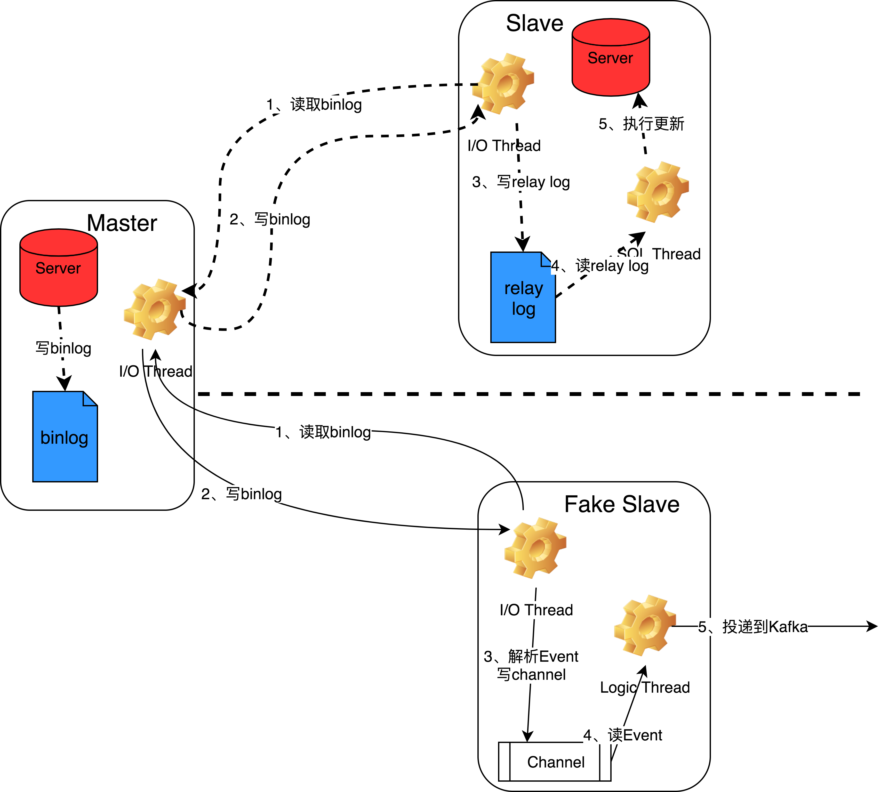

## 要求
- mysql server以row方式开启binlog，并且row image为FULL

## binlogbroker工作流程
- 模拟mysql slave server，解析binglog, 将数据投递到kafka
 
 
 
## 包含功能
- 通过binlog同步msyql数据，将数据根据规则投递到Kafka
- 可自定义需要同步的库表
- 在线添加和删除需要同步的库表(配置文件保存在etcd)
- 默认Topic是schema名称, Partion Key是Table Name
- 支持配置Topic以及以某个字段做partion key, 比如：按照订单ID做partion key
- High Availability(基于etcd)
- Kafka消费端可以将消息序列化为json、struct(golang)

## etcd在项目中的作用
- 保存配置信息(配置信息也可以通过-c参数通过命令行提供)
- 保存mysql 主从复制的binlog文件名和position
- 基于etcd的锁机制实现binlogbroker自身选主逻辑

## 基于binlogbroker能方便的实现哪些功能?
- 数据同步
- 缓存更新
- 实时统计
- 基于数据变动事件通知
> binlog文件名和position是定时保存到etcd，暂时不能保证消息不重复投递,只能保证顺序投递

## 使用 
### 部署
1、服务依赖
- Kafka：binllogbroker将解析后的binlog投递到kafka，使用方消费kafka消息
- etcd: 保存元数据和配置信息，HA实现

2、启动: binlogbroker -g db_mall -c xxxx[-etcd xxxxx]
  > -g db_mall: -g参数是必填项, db_mall是一个数据库实例的别名, 比如localhsot:3306
  > -c 从命令行传递配置文件(json格式), -etcd:通过读取etcd获取配置文件

3、HA部署
- 建议一个mysql实例配置两个binlogbroker(称为broker_a, broker_b)到不同的机器(跨服务或者机房)
- 保证同一时刻只会有一个broker在工作
- broker_a(master)工作时，broker_b(slave)会休眠，不会连接到mysql实例
- broker_a出现故障时会自动退出，此时broker_b转换为master; broker_a恢复时自动变为slave

4、其他
- binlogbroker启动时会获取上一次保存的master binlog 文件名和postion，获取不到的话会从最新位置开始
- 删除etcd里面保存的position信息:
```
curl -XDELETE "http://localhost:2379/v2/keys/position/binlogbroker/db_name"
db_name: 是binlogbroker命令行启动时的-g参数
```
### 配置文件
  - 配置文件：
    > 一共两部分配置: broker自身相关的配置文件; 需要同步的数据源配置

    a、-c 参数提供配置文件名, 参考:binlogbroker/binlogbroker.conf.json
    b、通过etcd获取配置文件
      自身配置文件key名称: binlogbroker(已经配置好，无需配置)
      数据源配置key名称: binlogbroker:${group}, group是命令行 -g参数
  - 自身配置:
  ```
  {
        "LogDir":"./log/",
        "LogFile":"binlogbroker.log",
        "KafkaAddr":["localhost:9092"],
        "RPCListen":":8846"
    }
  ```
  - 数据源配置
  ```
  {
        -- 数据库连接
        "MysqlConn":"rep_user:rep_user@tcp(localhost:3306)",
        //当table为空时，是否同步全部表的数据
        "SyncAll":false,
        //数据源
        "Sources":[
            {
                //数据库名
                "Schema":"mall_db",
                //数据库里对应的表，如果未配置topic和key， kafka默认topic为schema name，key为table name
                "Tables":[
                    {
                        "Table":"goods"
                    },
                    {
                        //表
                        "Table":"package",
                        //该表的数据投递到kafka的主题名
                        "Topic":"mytopic",
                        //投递到kafka时，对应的partition key名, 比如 order_id
                        "Key":"usr_id"
                    }
                ]
            },
            {
                //如果 SyncAll为true, 则social_db所有数据都会同步
                "Schema":"social_db",
                "Tables":[
                ]
            }
        ]
    }
  ```
### 如何消费Kafka数据
- 参考 apps/democonsumer代码


## 感谢
- [binlog解析库siddontang/go-mysql](https://github.com/siddontang/go-mysql)